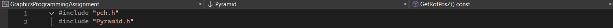

# Graphic Programming Assignment

**Degree Year 2 Semester 2 Project**

## 📖 Project Overview

This project is a hierarchical 3D robot simulation engine built from scratch using **C++** and **OpenGL**. It demonstrates the implementation of a raw 3D rendering pipeline, complex articulated character animation, and a custom input system.

### Key Features

* **Hierarchical Modelling:** Implemented a complex parent-child relationship system (Backbone, Limbs, Fingers) to achieve realistic articulated movements.
* **Advanced Animation:** State-based animation system supporting Locomotion (Walk, Run, Jump) and Combat (Attack, Block, Shoot).
* **Custom Input Manager:** Robust input handling integrating DirectInput and Windows Input.
* **Camera & Environment:** Dynamic camera system supporting Perspective, Orthographic, and Frustum views.
* **Detailed Articulation:** Fine-grained control over individual body parts, including independent finger rotations and wing mechanics.
* **Rendering Features:** Implementation of lighting (GL_LIGHT0), texture mapping, and geometric primitives.

---

## User Manual (Controls)

The system operates in **Three Modes**. Press `TAB` to switch between modes.

### Mode 1: Camera & Environment (Default)

intended for viewing the character from different angles and debugging.

| Category | Action | Key Input |
| --- | --- | --- |
| **Camera** | Move (Front/Back/Left/Right) | `W`, `S`, `A`, `D` |
|  | Move (Up/Down) | `E`, `Q` |
|  | Speed Up | Hold `SHIFT` |
| **Light** | Move Light Source | `I`, `K`, `J`, `L` (Plane) |
| **View** | Perspective / Ortho / Frustum | `X` / `C` / `V` |
| **Features** | Toggle Axis Lines | `Z` |
|  | Toggle Wings | `6` |
|  | Change Weapon Pattern | `7` |
|  | Debug Info | `F1` |

### Mode 2: Robot Movement

Control the robot's locomotion and combat actions.

| Category | Action | Key Input |
| --- | --- | --- |
| **Movement** | Move Character | `T`, `G`, `F`, `H` |
|  | Jump | `SPACE` |
|  | Sprint / Run | Hold `SHIFT` |
| **Combat** | Attack (Sword) / Shoot (Gun) | `Mouse Left Click` |
|  | Block (Shield) / Aim | `Mouse Right Click` |
| **Equip** | Sword / Gun / Shield | `1` / `2` / `3` |
| **System** | Reset Position | `R` |

### Mode 3: Articulation Control

Manual control of every individual body part.

**Step 1: Select Part**

* `1` - `2`: Head / Body
* `3` - `6`: Arms (Upper & Forearm)
* `7` - `8`: Hands
* `9` - `=`: Legs (Upper & Lower)
* `[` - `]`: Feet
* `\` : Wings
* `;` / `'`: Fingers
* `F2`: Pelvis

**Step 2: Manipulation**

* **Rotate/Move:** `T`, `G`, `B` (Positive)
* **Reverse Direction:** Hold `SHIFT` + `T`, `G`, `B`
* **Finger Control:** `N`, `M`, `,`, `.`, `/` (Thumb to Little Finger)

---

**Image of robot**


---

## Development Guide

### About Including Libraries

Please include your libraries in `pch.h` to prevent include conflicts.

**Important Rule:**
After adding your libraries, whenever you create a new class or any `.cpp` file, you **must** write the following line at the very **top** of the file:

```cpp
#include "pch.h"

```

*(See the example image below)*

### Configuration Steps

If you add a new file, you need to configure it correctly in Visual Studio:

1. Right-click the `.cpp` file.
2. Select **Properties**.
3. Go to **C/C++** -> **Precompiled Headers**.
4. Set **Precompiled Header** to **Use (/Yu)**.
5. Set **Precompiled Header File** to **pch.h**.
6. Click **Apply**.

> **Warm Reminder:**
> Do not define macros that you frequently modify in **pch.h**. Otherwise, every time you change those macros, the entire project needs to recompile, which will take longer - save yourself the trouble! 😂
